# MIDI 控制器 DIY 记录

## 前言

本文档记录了我就读工业设计专业时自学尝试完成的一个完整项目。

起点和灵感来源是一个Youtube视频教程 [FADR-4](https://www.youtube.com/watch?v=oAxvV_dByz0&list=PL651BYGu4npl_MTVBo3SNnxcNL3TDUJn-&index=1&t=27s)，跟着他的教程做了一个4路手动推子版本。后来在基于arduino开发板的开源库[Control Surface](https://github.com/tttapa/Control-Surface)里看到了电动推子版本的实现。

当时是大一，想着这个产品也可以继续作为专业学习的学习延申，于是想着继续拓展，接着做了4路的电动推子版本，并进行了其它元件的拓展和尝试。

在过程中遇到一个买家想要定制15路电动版本，我想着15路是4路的拓展，只需要确认单片机处理能力和供电问题，理论上是可以实现的。在后续试验后发现可以满足，于是答应了这个订单。然而后来证明完全低估项目复杂度，一个人精力不足导致这个项目战线冗长而进展缓慢，大概花了我大一到大三两年左右的时间才最终完成。

在此过程中，4路电动推子作为基础款以及16旋转编码款卖出去了很多套。但最终15路项目却失败交付,在本地运行测试功能没有问题，但寄过去发现还有bug，这样来回一次，3D打印的外壳就出现了运输折损的问题，而15路的外壳成本是很高的，最终便只能协商失败交付。

回过头来除了最终版本失败交付外，最大的可惜就是由于太注重功能的实现而忽略了产品本身的设计感，最后只是沦为一个大型demo项目。此外很多不成熟的地方，代码当时甚至没有用git管理。

当时没有很好维护规划好源文件，现以此文档作为一个零碎的回顾和总结。

## MIDI 控制器是什么？

MIDI控制器大多通过USB接口连接电脑，与音乐宿主软件通过MCU（Mackie Universal Control）协议下进行[midi](https://nickfever.com/music/midi-cc-list)信息传输，从而实现控制宿主软件的各类参数，如音符信息、轨道音量、效果参数等等。

你可以理解它是一个键盘，鼠标类的电脑外设设备，只不过其是专门用于控制对应的支持MIDI协议的宿主软件的，大多是声音设计软件如Fl Studio, Studio One, Nuendo, Cubase, Reaper等等(但不支持Pro tools，因为它是走自家专用协议的)，还有视频后期软件Davinci，或VJ行业的舞台灯光控制软件如Resolume Arena。

## 产品列表

### 4路 手动推子 + 数值显示led屏

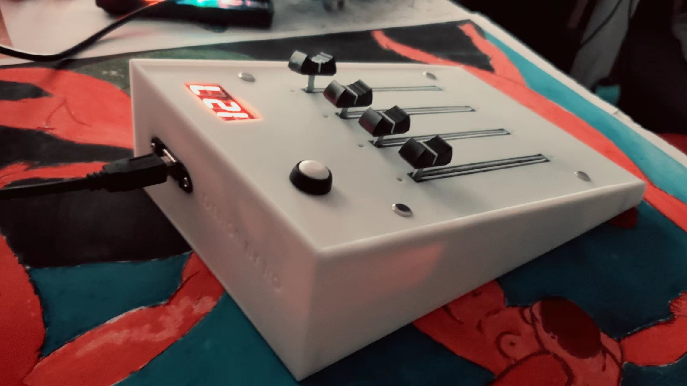 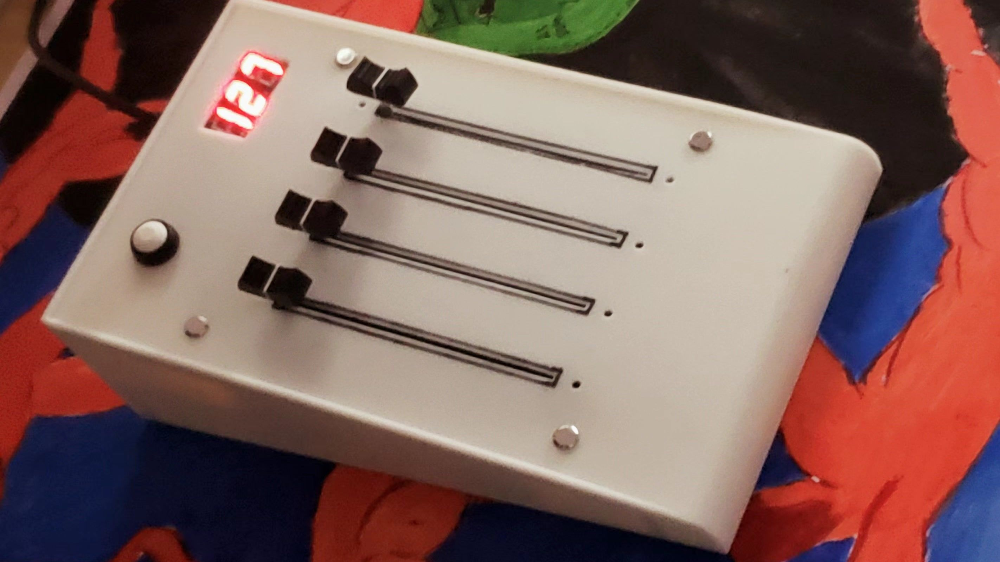

---

### 8路 电动推子 + 8 RGB 按钮 + 8 旋转编码器（Rotary Encoder）

> 状态：未完成。8路初版电路板错误问题太多，后转而先做4路版本。

---

### 4路 电动推子 + 4 RGB 按钮 + 4 旋转编码器（Rotary Encoder）+ 分页按钮

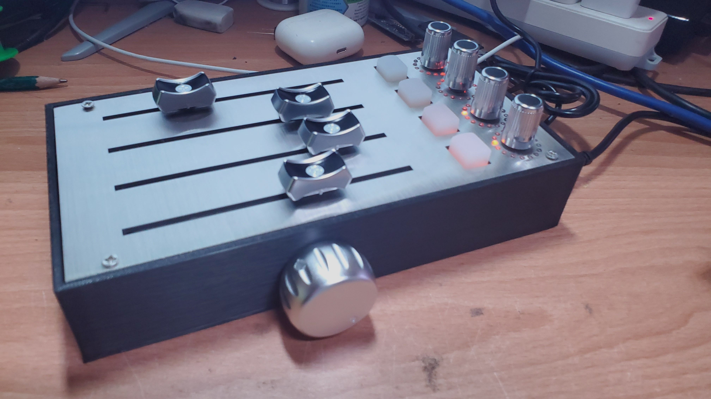 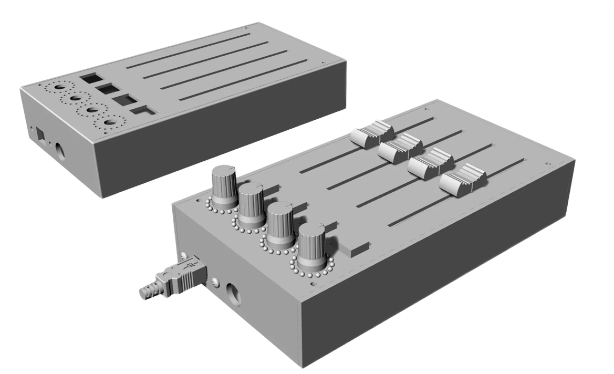

*图4-5: 4路电动推子版本实物与渲染图，配备分页按钮用于切换MIDI通道*

---

### 16 旋转编码器（Rotary Encoder）+ 分页按钮

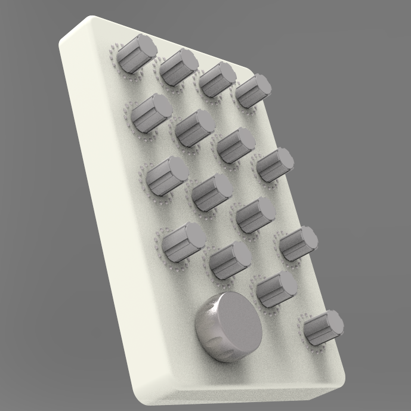 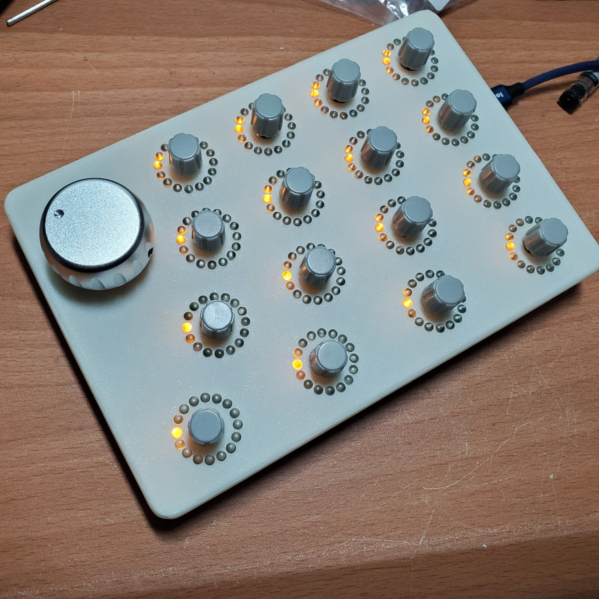

*图6-7: 16旋转编码器版本渲染图与实物，使用4个MAX7219驱动256个LED环形指示灯*

---

### 15路 电动推子 + 75 RGB 按钮 + 15 旋转编码器（Rotary Encoder）

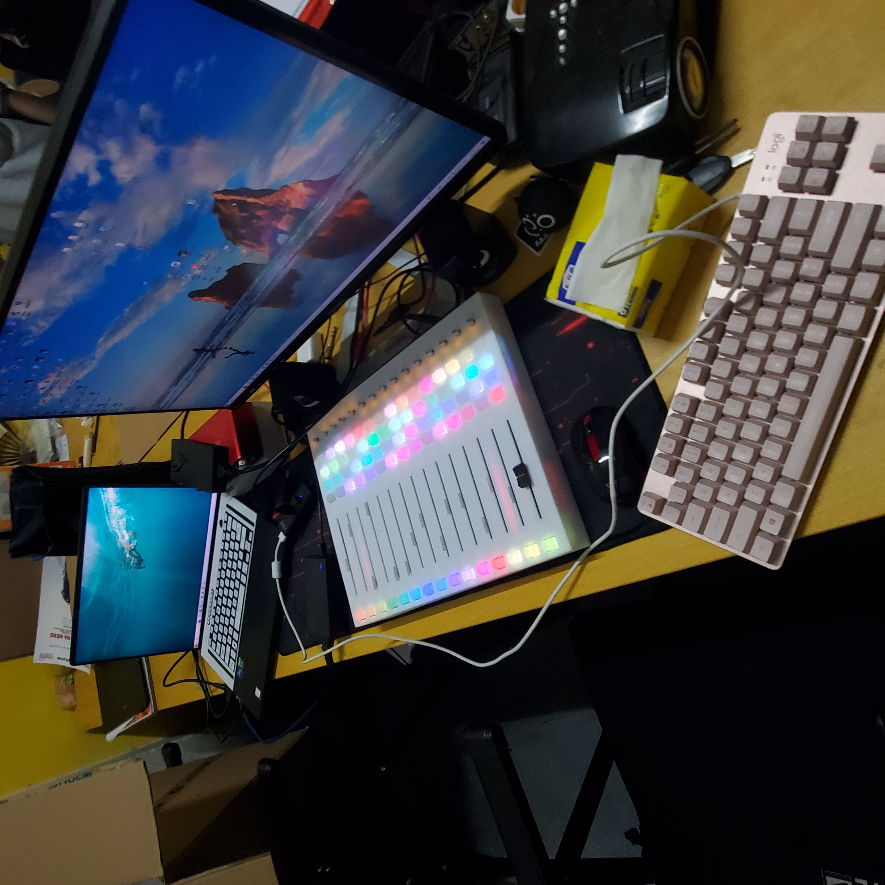 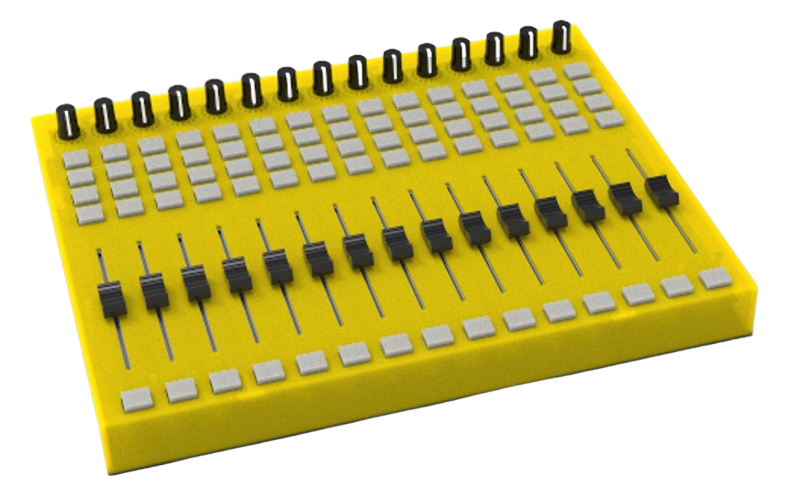 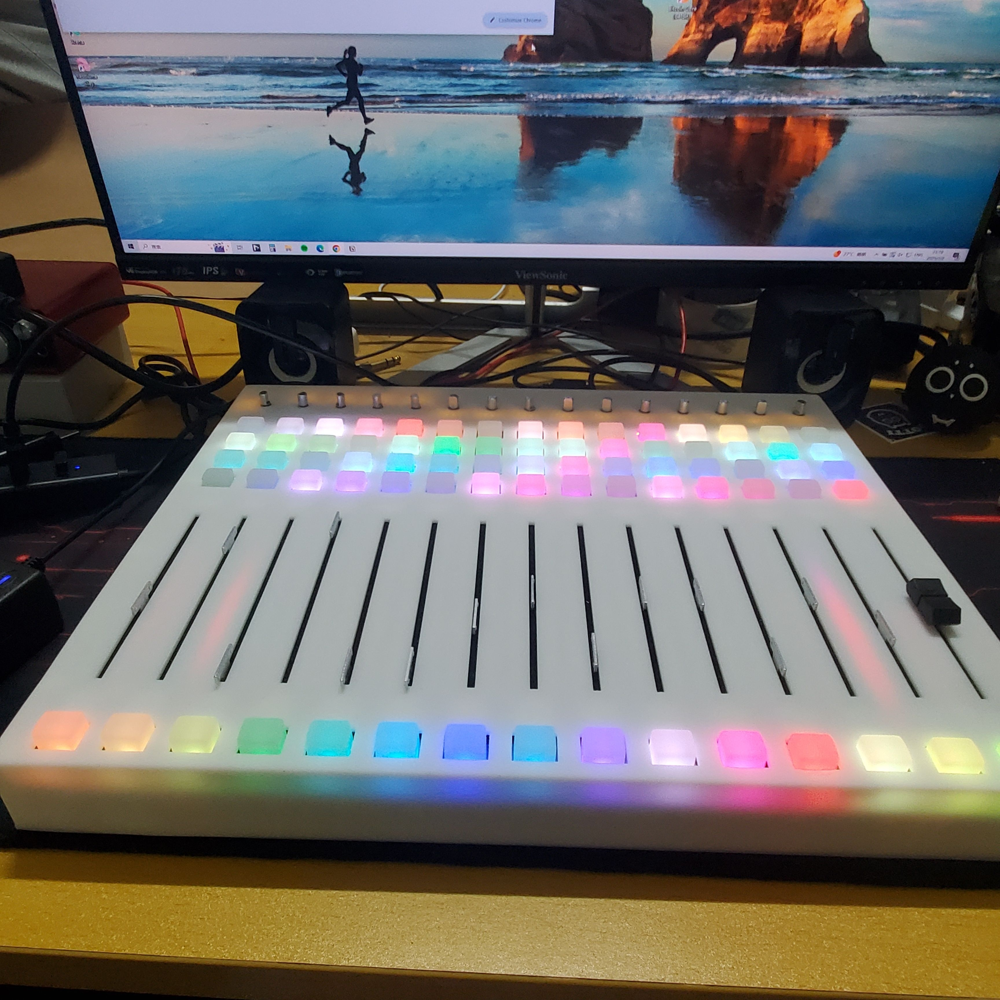

*图8-10: 15路VJ专用版本，采用分板设计，通过FPC软排线连接4块电路板*

### 15路VJ版 - 结构设计

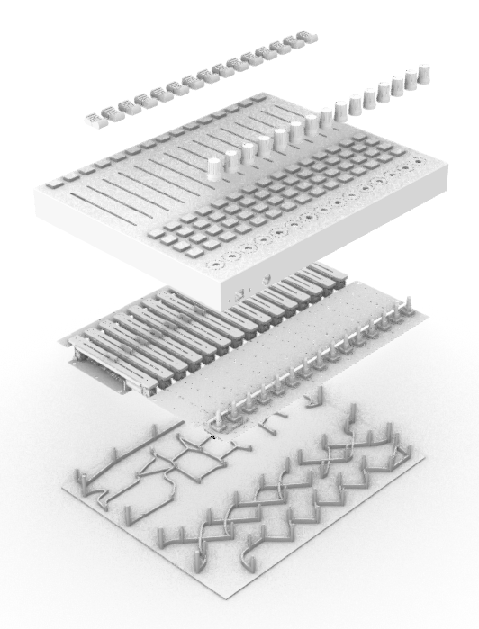 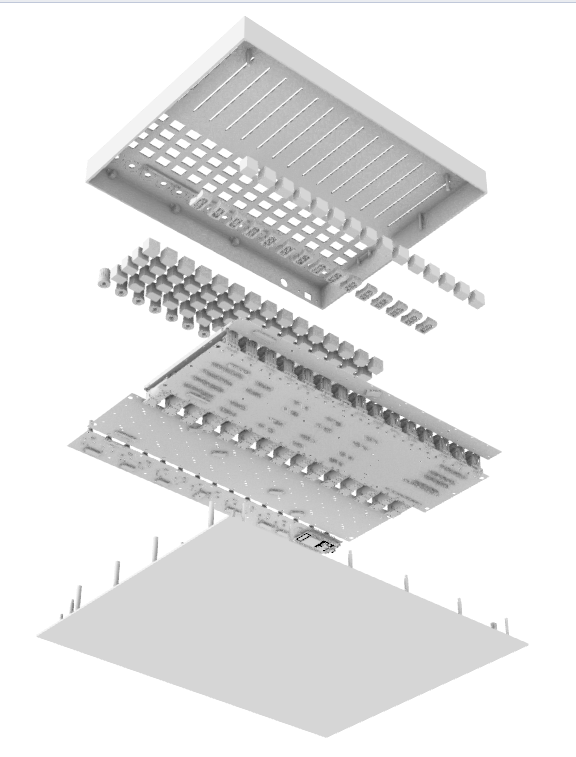


*结构爆炸图*

<p align="center">
  
</p>

## 第一部分：项目回顾与技术解析

## 电动推子是如何实现的？

[Control Surface Motorized Faders Pages](https://tttapa.github.io/Pages/Arduino/Control-Theory/Motor-Fader/)

本项目的电动推子就是基于Control Surface的Motorized Fader的实现进行模块化拓展。

下面是简单概述：

推子是一个线性的滑动变阻器，因此其接入单片机的adc接口我们可以对其进行推子位置和发送信号的线性映射。

非电动的推子是单片机单向和电脑通讯，单片机只需要发送出信号即可。当我们手指滑动推子时，屏幕上的软件UI所对应的值根据软件的MCU协议编写的midi协议代码规则，如果接受到绑定监听的midi消息，则更新到midi cc编号上的对应值，普通midi编号值精度是0-127，mcu协议下的fader精度可达16384(2^14)。

如果我们鼠标移动或者在电脑端改变了软件UI值呢？虽然大部分宿主软件的midi协议是可以双向发送的，也就是当我们鼠标拖动软件值时，如果其有绑定到一个midi channel和编号，比如说channel 16，midi 001，那么宿主软件也会发送出0-127的映射值。

但，手动推子的单片机并不会理会电脑传回来的midi消息，更没有电机去驱动反向更新物理推子的位置。

那么我们来看看Control Surface库提供的电动推子实现方法。

- 硬件升级

  我们将原来的推子从滑动变阻器升级为了电容感应+电机驱动滑动变阻器，并且是由nano进行adc值转化。

- I2C

  原先比如说我们只有一个arduino leonardo板，只滑动变阻器的adc发送工作就可以了。但我们现在需要引入第二个开发板，我们这里使用arduino nano，其专门用来控制电动推子并和leonardo板，也就是其master板通讯。

  I2C的作用是什么呢？
  
  想象我们现在电脑发送给leonardo板消息，要让Leonardo板根据它的目标值去控制电机更新推子位置，但Leonardo作为主板的任务是很繁重的，控制电机的驱动需要实时更新引脚输出电压，其实是通过pwm引脚调节频率实现调节电压的，这是一份很重的任务，同时每个开发板的带有pwm功能的引脚非常有限，控制一个推子需要有两个pwm引脚唱对手戏。

  那么我们就可以用I2C技术了，I2C可以让Leonardo化身master主板，拥有最多128个slave板，相当于老板将自己的任务分发给手下的人去做，只需要将电脑的值告诉手下就可以，在电动推子这个情况，手下做得怎么样Leonardo都不管，只管把任务丢出去就可以。

  因为i2c的可拓展性，leonardo得以解放，可以控制n个推子了，只要给推子的外部额外电压给力，slave数量足够多。当然实际还是有上限的，而且越多i2c容易信噪比越大，信号容易有错误。

  I2C是本项目能从4路拓展到15路的原因，也是下一个部分旋转编码器实现的方法。

- PID算法

  pid算法是用于实时控制推子最优化导向目标位置的算法。这部分代码主要是arduino nano实现，master板在一个固定的resolution下不断告诉nano板目标位置，也就是由电脑返回过来的ui值变化。naono板同时接受目标位置和读取变阻器瞬时位置，根据pid算法将调整量转化为电机的驱动方向和动量，实则输出为pwm频率/电压，从而实现鼠标拉动电脑ui值，物理推子实时反馈更新位置的pipeline.

  这一套流程一样还可以应用于比如说摄像头位置跟踪等应用。

- 电容感应

  需要注意的是，这里还有还有一层反馈loop，不知道你是否注意到上文的硬件升级中提到我们现在的推子是有电容感应功能的。
  
  电容感应的作用是什么呢？

  如果没有电容感应的话，当电脑反馈midi消息给master板再给nano板时，nano板通过pid驱动电机移动推子位置。但你还记得手动推子是怎么把值传给电脑的对吧，推子位置变化本身会作为滑动变阻器的阻值变化被映射为midi值的变化而被发送出去，关键的问题是这条传输链是有延迟的。我们可以想象，当我们在t0时刻拖动鼠标，t1时刻电动驱动，t2可是推子值发送了变化向电脑发送了t0时刻鼠标所抵达的值。但当t3时刻电脑再接受到midi值时，我们的鼠标控制的ui值已经不是t0时刻的值了，这样便造成了glitch行为。

  电容感应在这里的作用即是，额外有一个引脚会因为人体作为导电体当触摸到推子时引发电容变化，而使得原本由挂起电阻阻挡的电流流通，从而使得这个引脚被激活。这样我们就可以知道，现在是人在主动推推子，那么就允许推子发送信号，在pid控制被动更新位置的时候，推子的发送是被禁掉的。

  所以还有一个点是，我们不仅升级了推子硬件，连推子帽也得升级，不能是纯塑料的，得是导电材料的推子帽才可以。

## 旋转编码器（Rotary Encoder）是如何实现的？

上文我们讲了电动推子是如何实现的，那么其实旋转编码器的实现就比较简单了。一样我们可以举普通旋钮来作为对照例子，普通旋钮和普通手动推子一样，是一个有极值的线性变阻器，不过不是滑动变阻器，应该叫旋钮变阻器了。

我们如果让旋钮双向更新呢？我们并不需要推子，事实上，旋转编码器vs普通旋钮和电动推子vs手动推子还是有不小差别的。

旋转编码器已经不再是一个变阻器了，它和普通旋钮最大的区别是普通旋钮比如说可以转1圈半就转不动了，达到极点了，反过来也一样。而旋转编码器可以顺逆时针无限转下去。

- 旋转编码器的原理

  旋转编码器所输出的不是阻值大小，而是旋转了多少度，输出的是脉冲信号。我们这里用的是机械的旋转编码器，它的内部结构有两个金属触点，在转动的时候分别持续输出代表的AB两个方波。
  ```
  00 → 01 → 11 → 10 → 00 （顺时针）
  00 → 10 → 11 → 01 → 00 （逆时针）
  ```

  我们可以把这里的第一位视作B点，第二位视作A点。
  我们可以想象，你背后有两个小孩，右后方是A，左后方是B，它们的位置不动，此时你看不到它们，你的状态是00，此时你如果开始顺时针旋转，那么每次当你身子转过来的时候你的眼睛总会先看到小孩A，然后才是小孩B，此时为01，然后转到AB都在视野里，此时为11，然后是10，00。逆时针则反之。

  旋转编码器输出给单片机有多少个这样的loop就是它转动了多少圈，多少角度。它每次输出的是相对值，我们在本地储存一个midi cc值，这样就做到了旋转编码器增大和减小midi cc值了。

- 旋转编码器的双向通讯

  那么旋转编码器是怎么做到双向通讯的呢，实际上旋转编码器在电脑值更新时没有任何反应，变化的只是indicator围绕它周围那一圈的led位置。也就是当电脑返回值时，我们本地储存的midi cc值便会变化，下一次当我们旋转编码器主动旋转的实时，则是基于这个值进行更新的，这样我们便做到了视觉上旋转编码器的灯光值永远和电脑软件ui值双向通讯的同步。

- I2C

  好像我们还没有讲为什么旋转编码器要额外放到slave板上用i2c和主板连接。实际上的原因是也非常简单，旋转编码器非常耗芯片的处理带宽。如果我们把这部分工作交给slave板的话，主板的负担就可以简小很多了。

  此外，i2c在旋转编码器这里不仅是一级i2c，因为旋转编码器数量众多的原因，slave板本身是通过i2c控制mcp23017来拓展gpio引脚来连接旋转编码器的。

  在我们这个项目里，负责处理旋转编码器的单片机esp32 s2既做slave又做master，一开始我以为不能这样，所幸最后成功，这才得以实现旋转编码器的双向通信。

## 15 Channels的设计

15路的版本的设计，主要是两个点，一个是模块化设计，一个是电路板的分板设计。

- 模块化设计

  模块化设计也不是这个有意为之，而是硬件开发本身传感器和传感器之间便可以视为为一个模块类。但确实也是因为这个思考，我在做出4路的版本后便确认15路是可以完成的，而且也不需要如arduino mega这样的超多引脚，只需要esp32 s3作为主板，用i2c把其它监听任务分配出去即可。

  我们提到了i2c可以模块化支持多个nano来拓展至多个电动推子，也提到了ESP32 s2本身slaves MCP23017来拓展多个旋转编码器。除此之外，还有按钮元件，那便是得以靠multiplexer多路复用器拓展。此外，n个rgb灯光则得益于ws2812灯带仅靠一个引脚便可以控制多个灯光点而不需要额外拓展。

- 分板设计

  因为按钮，电动推子的高度不同，最终15路的版本电路板一共分成了4块板子，中间通过FPC片进行连通。这样还有一个好处是最后测试的时候得以解耦测试查看是哪个板子出了错误。

  不过分板设计在4路的时候就已经应用了，4路版本是分了两个板子。

---

感谢您看到这，下面是以16旋转编码器版本为例的DIY参考教程教程。

## 第二部分：16旋转编码器 DIY 制作教程

### 设计预览

 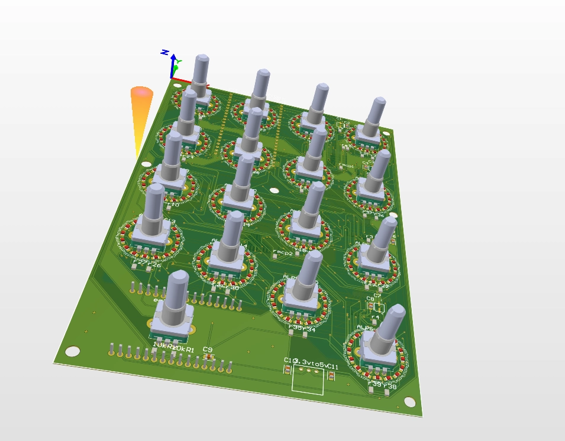

*图11-12: 设计草图与PCB 3D预览*

### 制作过程

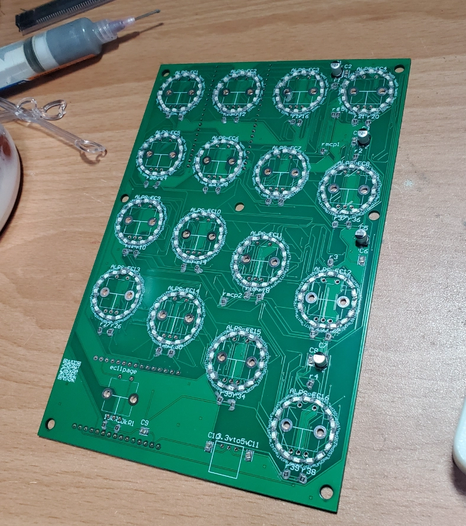 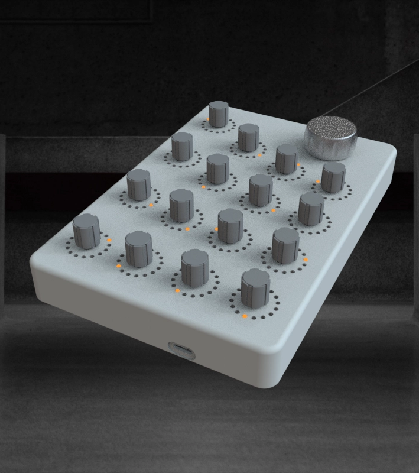

*图13-14: LED焊接过程与渲染效果图*

### 成品展示

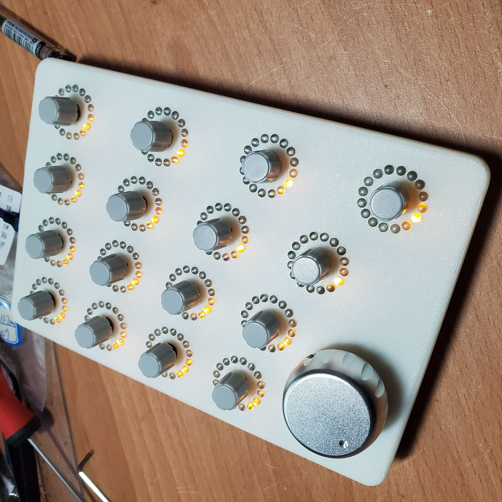 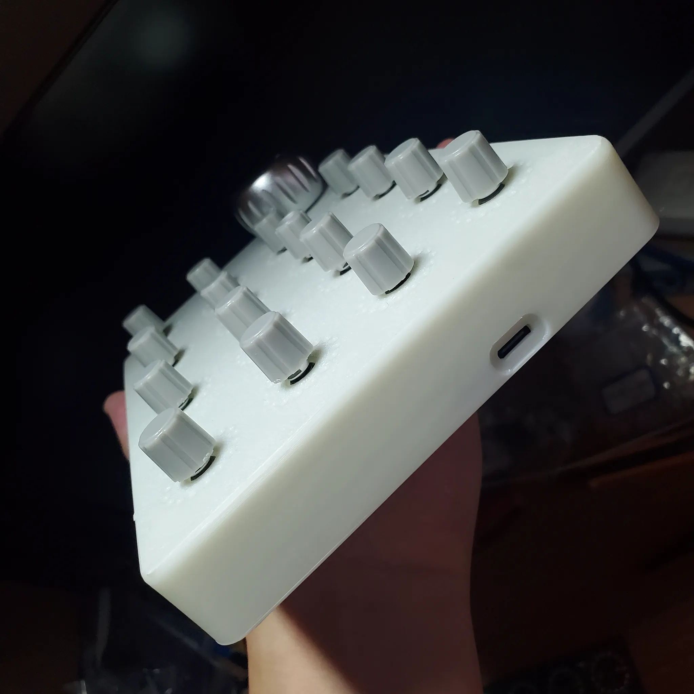

*图15: 16旋转编码器成品实物*

## 准备工作

所需文件已放在[github repo](https://github.com/JerryHong08/jerry-midi-controller)中。

* 软件

  * 代码烧录

    **[推荐/必须]** 推荐只使用VS Code.

    MIDI控制器的MCU芯片是由Arduino以及ESP32单片机驱动的，因此我们需要准备针对Arduino&ESP32的烧录软件，也就是对应IDE。这里可以使用Arduino官方的[Arduino IDE](https://www.arduino.cc/en/software)或者[VS Code](https://code.visualstudio.com/). 本教程会两者都使用。Arduino for Arduino，VS Code for ESP32.

  * PCB 打印

    **[推荐/必须]** 如果你只需要直接使用我已经验证过的电路板，那么可以直接使用文件清单里的`.pcb`PCB文件。PCB下单打印的服务我使用的是嘉立创平台，可能3-4天甚至更快就能从下单到收到货。
    你需要在电脑端下载[嘉立创](https://www.jlc.com/)，注册账号登陆进行PCB打印下单。

    *[可选]* 如果你有优化修改PCB电路图，或者调整元件排版和位置的需求，可以下载[Altium Designer](https://www.altium.com/altium-designer)设计shcema和PCB排布。

    *因为我没有维护整理元件库,我的schema只能做参考了*

  * 3D 建模

    **[推荐/必须]** 如果你只需要使用我已经验证过的3D建模外壳，可以直接使用文件清单的里的`.stp`3D模型文件。
    3D打印我使用的是淘宝平台，自行在淘宝搜索3D打印服务商家提供建模文件即可。

    *[可选]* 如果你有优化修改3D外壳，或者调整元件排版和位置的需求，可以下载你熟练的建模软件重新建模。我使用的是犀牛[Rhino7](https://www.rhino3d.com/download/)，你可以在Rihno里直接打开我的`.3dm`进行二次编辑再调整。

    *在我当时的源文件基础上二次修改的难度较大，更推荐重新建模，源文件仅供参考。*

* 硬件工具

    对应PCB板的元件焊接，需要准备：

    *锡焊枪* x1、*焊枪架* x1、*锡焊台* x1、*高温吹风焊枪* x1(如果有元件拆卸重焊需求)

---

### BOM表单

第一步是下载github repo里的16 旋转编码器文件夹下的`物料单.csv`打开，购买里面列出的16 旋转编码器所需要的对应的物料。购买链接也已列出，如遇到购买渠道链接失效可以根据元件型号自行搜索下载。

---

### 代码

一共有两块单片机板，一块是ESP32 S3，一块是ESP32 S2，简单来说S3负责和电脑通讯midi协议，S2负责和旋转编码器通讯。所以一共需要分别上传两次代码到两个板子上。

ESP32 S2上传ESP32 S2的代码，使用VS code平台，下载platform io进行上传

ESP32 S3上传16Encoder.ino代码，这里使用Arduino IDE平台

需要下载准备好Control Surface库

---

#### ESP32 S3代码上传

* 线材：typec

* 软件代码平台IDE：Arduino IDE

<!-- * 安装网址：https://www.arduino.cc/en/donate/ -->

---

#### 教程

1. 安装ESP32环境 [教程视频](https://www.bilibili.com/video/BV1BGRPYXEeH/?spm_id_from=333.337.search-card.all.click&vd_source=e3570e6b8922f3bf5d79f85f357c825e), ESP环境文件 [百度网盘链接](https://pan.baidu.com/s/1vizgbr7bZJgDKHfd1yFC6A?pwd=q2m5)

2. 重启Arduino，打开16encoder.ino

3. 插上ESP32-S3，需要注意ESP32有两个口，一个是用来上传烧录代码的，一个烧录好作为midi控制器的正常使用插口的。烧录时接2号烧录端口，烧录完成后接1号OTG端口使用。

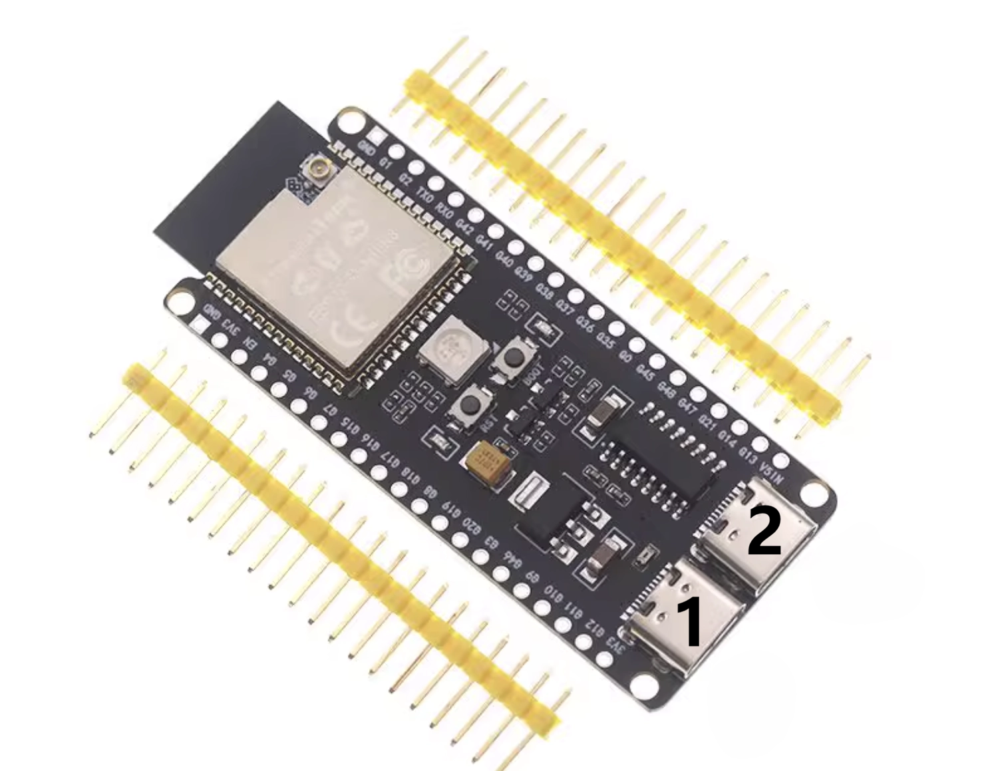
*图16: ESP32-S3开发板的烧录端口(2号)和OTG使用端口(1号)位置说明*

4. 配置上传ESP32 S3设置

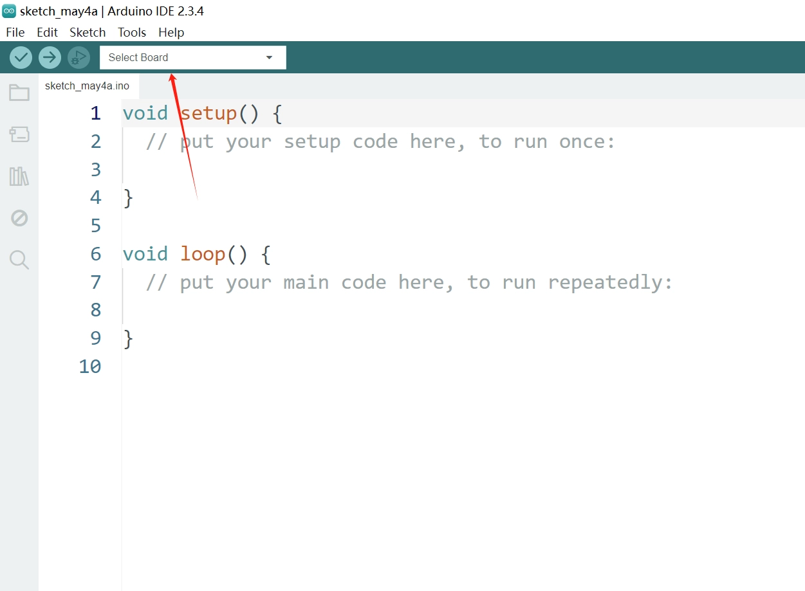
*图17: 在Arduino IDE中选择ESP32-S3开发板型号*

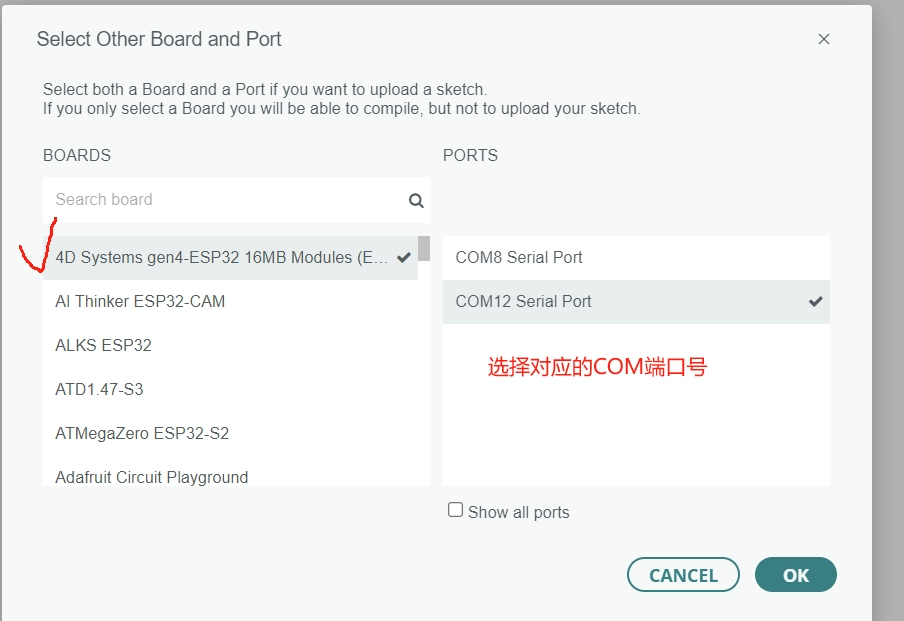
*图18: 配置正确的COM端口和Flash分区方案*

5. 在Tools里找到最后一个USB Mode，切换为USB-OTG(TinyUSB)

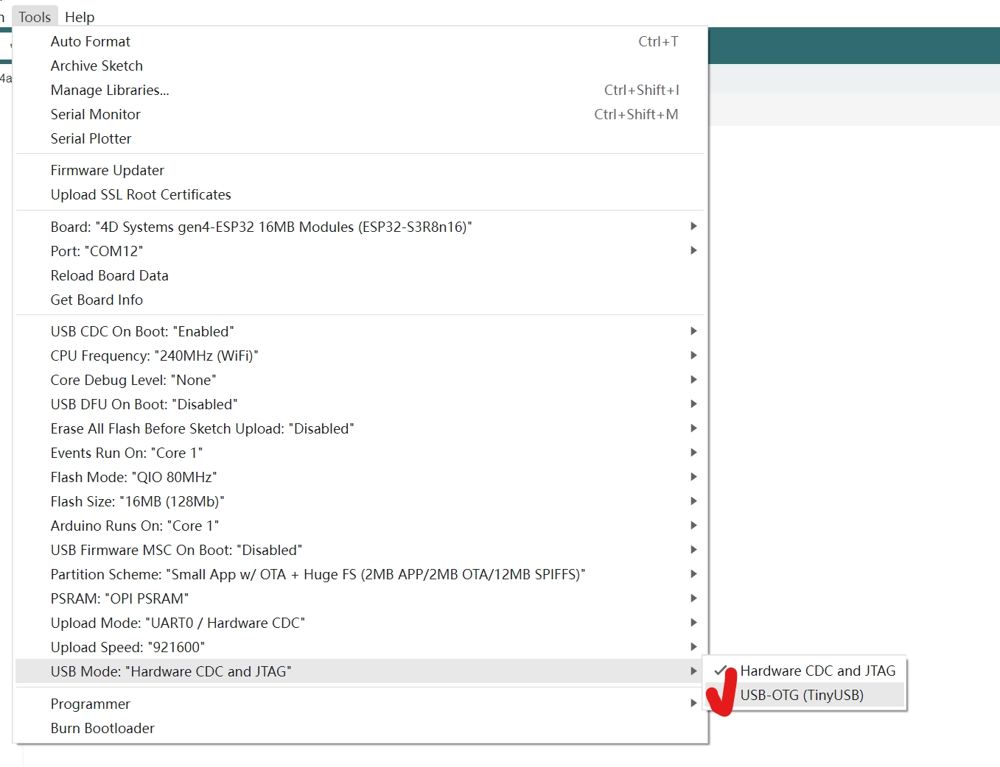
*图19: 在Tools菜单中选择USB-OTG(TinyUSB)模式以支持MIDI功能*

6. 在右侧libraries框搜索缺少的库，如Control_Surface、LedController等等

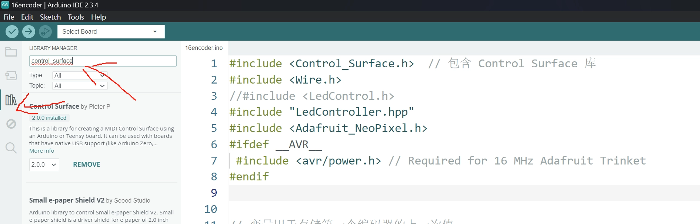
*图20: 在库管理器中搜索并安装Control_Surface等必要库*

7. 上传代码烧录

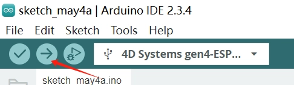
*图21: 点击上传按钮将代码烧录到ESP32-S3开发板*

---

#### ESP32 S2代码上传

* 线材：安卓口micro线

* 软件代码平台IDE：VS Code + 拓展 platform io（可以在VS Code拓展里下载）

---

#### 教程

1. 在安装完VS Code后，在拓展里搜索platform io然后安装


*图22: 在VS Code扩展市场中搜索并安装PlatformIO IDE*

2. platform io文件夹选择。选择16encoders_ESP32S2代码作为项目文件夹

3. 这里选择端口，可以选择auto，也可以插上ESP32S2后选择对应的COM端口

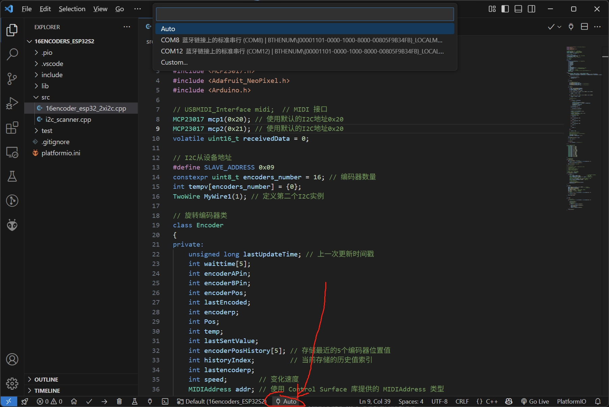
*图23: 在PlatformIO底部工具栏选择正确的COM端口进行烧录*

4. 如果有前面#include这些库文件缺少报错的话，可以去platform io libraries里这里搜索下载，boards环境缺少也同理。


*图24: 在PlatformIO库管理器中搜索缺少的依赖库*

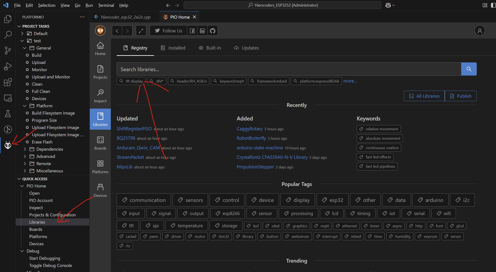
*图25: 点击安装按钮添加所需库到项目*

5. 如果没问题可以正常，确认端口选择正确就可以点击上传了。

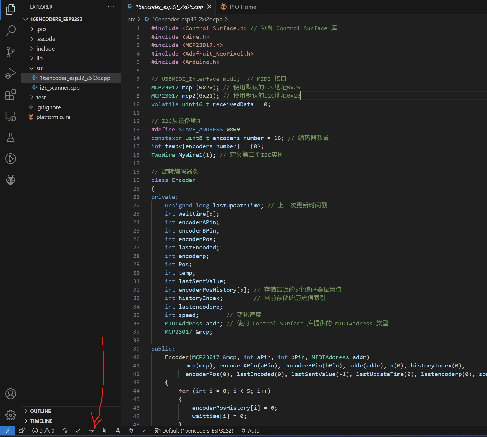
*图26: 点击PlatformIO底部工具栏的上传按钮将代码烧录到ESP32-S2*

---

### 电路

#### 打印下单

1. 电路文件在是对应repo链接里16encoder文件下pcb文件夹里的的`16encoder_PCB.rar`，在上文的[准备工作](#准备工作)中的PCB打印我提到过**嘉立创**下单PCB，这是最优的选择，下单也非常简单。

2. 在电脑端下载嘉立创下单商城软件，打开后登陆在主页点击`PCB/FPC下单`, 然后上传下载好的`16encoder_PCB.rar`附件。

3. 参数选择

```
  层数和尺寸都默认，板子数量根据需要所选，第一次选择最少要求5张即可。

  板材类型: FR-4
  确认生产稿选择：不需要
  出货方式：单板
  品质赔付服务：按标准合同常规处理
  板上加标志：选⼀个免费的即可
  是否需要SMT贴⽚：不需要
  是否开钢⽹：不需要
  确认订单⽅式：系统⾃动扣款并确认
  发货⽅式：都可以
  ...其它基本默认就可以
```

#### 焊接

* 因为我安装焊接过程中没有拍很多照⽚，所以⼤多是⽂字形式描述了。焊接需要注意安全，第一次尝试很可能失败，需要做好心理准备。对于16 encoder最大的难点对于256个小led，我们需要用焊台来和点焊枪来完成焊接。这里有[焊台教程视频链接](https://www.bilibili.com/video/BV17e411M744/?spm_id_from=333.337.search-card.all.click&vd_source=e3570e6b8922f3bf5d79f85f357c825e)。

---

1. ⾸先需要⽤焊台把256个led焊接好，先⽤锡焊膏针把锡焊膏挤在led的焊点上，然后
把led⼀个个摆好，需要注意围绕led灯元件是有极性的（这⾥可以也顺便把0.1uf贴⽚
电容等等⼀样⽅法焊上，也可以单独⽤锡焊枪焊）然后⽤焊台慢慢加热焊led，焊台温
度控制在250℃即可。

2. 焊好led下⼀步焊上⼀些元件如4067、mcp23017、max7219，锡焊⽅法为：先涂锡
焊膏到每个引脚，然后⽤焊枪⼀个个点。如果出现锡焊点粘连的问题可以⽤焊枪边焊
边往外拉，将粘连的锡焊拉开。这里有[锡焊膏参考视频](https://www.bilibili.com/video/BV1iX9qY6ESN/?spm_id_from=333.337.search-card.all.click&vd_source=e3570e6b8922f3bf5d79f85f357c825e)

3. 之后⽤焊枪焊3vto5v，(要确保这时候物料表⾥3vto5v以上的元件都已经焊上了) 然后再焊EC11, ESP32 S2, ESP32 S3。

4. ESP32 S3装好后可以type c插⼊电脑检测是否可以正常使⽤。

5. 如果可以正常使⽤后再进⾏最后的外壳装配：先将led导光柱⼀个个装到外壳上的导光
柱孔，装好后再将外壳和PCB板合上，⽤m2螺丝固定合上外壳。

---

### 外壳下单

外壳源文件在repo链接16encoder下的3d文件里`16encoder.step`。
在电商平台如淘宝搜索3D打印，找客服下单，可以选择自己想要的颜色，材质选ABS即可。

## 拓展链接

* [Midi CC](https://nickfever.com/music/midi-cc-list)
* [Build a Programmable USB Midi Controller - FADR-4](https://www.youtube.com/watch?v=oAxvV_dByz0&list=PL651BYGu4npl_MTVBo3SNnxcNL3TDUJn-&index=1&t=27s)
* [Control Surface](https://github.com/tttapa/Control-Surface)
* [MIDI Org](https://www.midi.org/specifications/midi-transports-specifications/5-pin-din-electrical-specs#:~:text=The%20MIDI%201.0%20Specification%20includes,circuitry%20and%20reduced%20RF%20interference.)
* [PWM](https://docs.arduino.cc/tutorials/generic/secrets-of-arduino-pwm)
* [Yealtex custom midi controller](https://yaeltex.com/)
* [按键原理](https://www.sohu.com/a/217394780_412863)